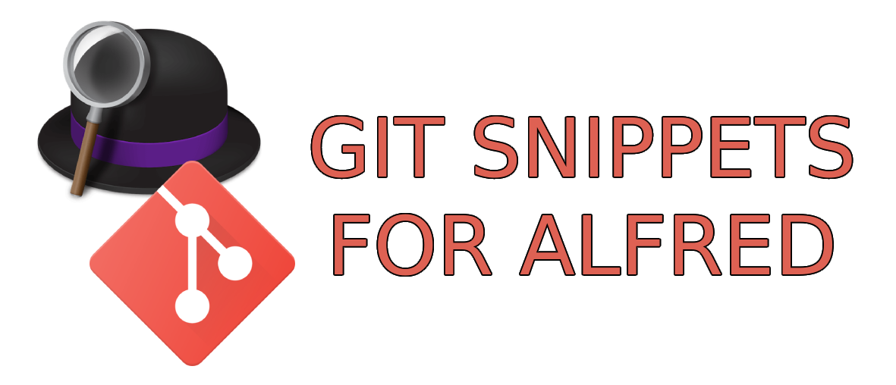

<div align="center" id="top"> 
  

  &#xa0;

  <!-- <a href="https://alfred_git_snippets.netlify.app">Demo</a> -->
</div>

<h1 align="center">Git snippets for Alfred</h1>

<p align="center">
  

  

  

  


  <!--  -->

  <!--  -->

  <!--  -->
</p>

<!-- Status -->

<!-- <h4 align="center"> 
	🚧  Alfred_git_snippets 🚀 Under construction...  🚧
</h4> 

<hr> -->

<p align="center">
  <a href="#dart-about">About</a> &#xa0; | &#xa0; 
  <a href="#sparkles-features">Features</a> &#xa0; | &#xa0;
  <a href="#white_check_mark-requirements">Requirements</a> &#xa0; | &#xa0;
  <a href="#checkered_flag-starting">Starting</a> &#xa0; | &#xa0;
  <a href="#memo-license">License</a> &#xa0; | &#xa0;
  <a href="https://github.com/antoniorodr" target="_blank">Author</a>
</p>


<div style="text-align:center"> 
  <a href="https://www.buymeacoffee.com/antoniorodr" target="_blank"></a>
</div>

<br>

## :dart: About

Git Snippets for Alfred is a snippets collection that enhances your productivity by providing easy access to frequently used Git commands directly from your Alfred productivity tool. Whether you're a seasoned developer or just starting, this collection allows you to streamline your Git operations.

## :sparkles: Features

:heavy_check_mark: Quick Access to Git Commands\
:heavy_check_mark: Custom Snippets\
:heavy_check_mark: Advanced Git Commands\
:heavy_check_mark: Access to your snippets from any PC throught Alfred

## :white_check_mark: Requirements

Before starting :checkered_flag:, you need to have [Alfred](https://www.alfredapp.com) installed.

## :checkered_flag: Starting

```bash
# Install the collection
Just download the file from releases and click on it.
```

## :memo: License

This project is under license from MIT. For more details, see the [LICENSE](LICENSE.md) file.


Made with :heart: by <a href="https://github.com/antoniorodr" target="_blank">Antonio Rodriguez</a>

&#xa0;

<a href="#top">Back to top</a>
